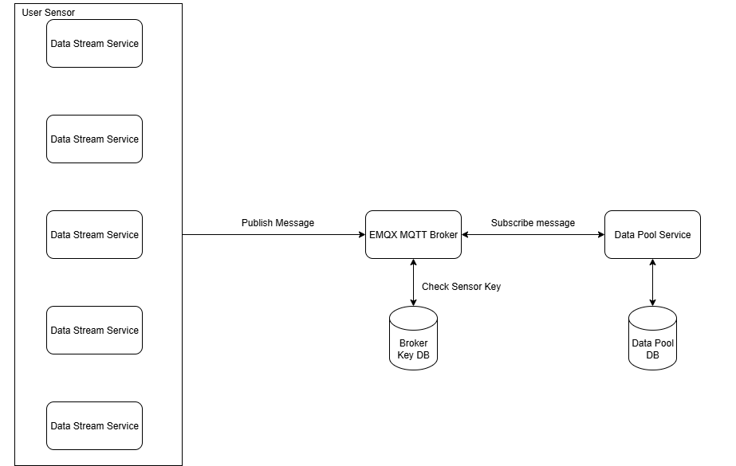
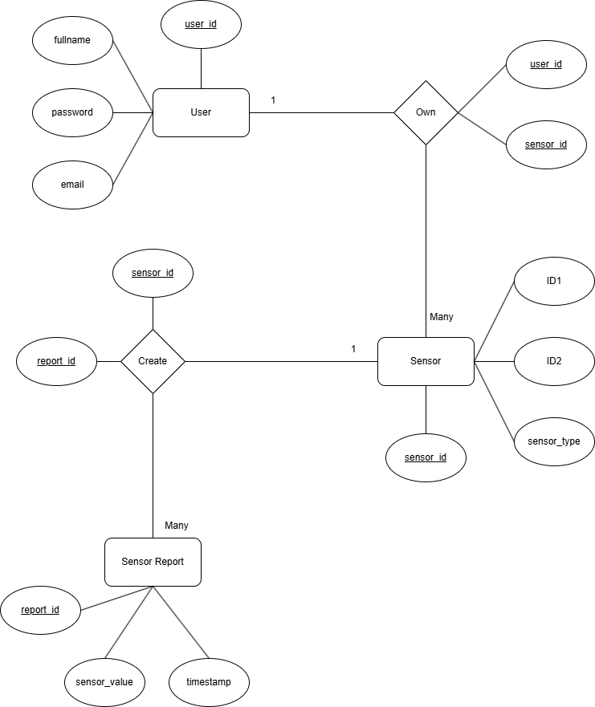

### Data Pool Service

The Data Pool Service is main part of the Sensor Pool microservice system. This service acts as a data pool and data viewer for the sensor data. This service will subscribe to a broker and provide a rest api for user to see their data.

### Architecture



### ERD



### Setup

1. Create and setup .env according to .env.example
2. Build the docker image, run command below:

   ```
   docker build -t <image name> .
   ```

   The command above will create an image of the app.

3. Create a container from the image and run command below:

   ```
   docker run -d --name <container name> -p 9000:9000 -v $(pwd)/.env:/build/.env <image name>
   ```

   The command above tell docker to create and run the image, in the command above we use dynamic .env for easier and more secure .env file configuration.

### REST API

This service provide rest api for user to Create, Read, Update and Delete their data. Here are the endpoint:

1. `POST /register` <br>
   This endpoint provide user with ability to create their account. Here are the request body:

   ```json
   {
     "FullName": "Muhammad Farhan",
     "Email": "a@mail.com",
     "Password": "12345"
   }
   ```

2. `POST /login`<br>
   This endpoint provide user with ability to login with their account. Here are the request body:

   ```json
   {
     "Email": "a@mail.com",
     "Password": "12345"
   }
   ```

3. `POST /sensors`<br>
   This endpoint provide user with ability to create their sensor . Here are the request body:

   ```json
   {
     "sensorType": "Temp",
     "id1": "A",
     "id2": 1
   }
   ```

4. `GET /sensors/reports`<br>
   This endpoint provide user with ability to get sensor report by using sensor ID1 and ID2 . Here are the request body:

   ```json
   {
     "id1": "C",
     "id2": 2
   }
   ```

5. `GET /sensors/idandduration`<br>
   This endpoint provide user with ability to get sensor report by using sensor ID1 and ID2 and add specific duration. Here are the request body:

   ```json
   {
     "id1": "C",
     "id2": 1,
     "start": "2025-08-27T19:06:12+07:00",
     "end": "2025-08-27T19:08:25+07:00"
   }
   ```

6. `GET /sensors/duration`<br>
   This endpoint provide user with ability to get sensor report by using duration without specifying the sensor. Here are the request body:

   ```json
   {
     "start": "2025-08-27T19:06:12+07:00",
     "end": "2025-08-27T19:08:25+07:00"
   }
   ```

7. `PUT /sensors/reports`<br>
   This endpoint provide user with ability to change all sensor report value by using sensor ID1 and ID2 . Here are the request body:

   ```json
   {
     "id1": "C",
     "id2": 2,
     "value": 100
   }
   ```

8. `PUT /sensors/idandduration`<br>
   This endpoint provide user with ability to change all sensor report value by using sensor ID1 and ID2 and specific duration . Here are the request body:

   ```json
   {
     "id1": "C",
     "id2": 1,
     "start": "2025-08-27T19:06:12+07:00",
     "end": "2025-08-27T19:08:25+07:00",
     "value": 100
   }
   ```

9. `PUT /sensors/duration`<br>
   This endpoint provide user with ability to change all sensor report value by using duration without specifying the sensor . Here are the request body:

   ```json
   {
     "start": "2025-08-27T19:06:12+07:00",
     "end": "2025-08-27T19:08:25+07:00",
     "value": 100
   }
   ```

10. `DELETE /sensors/reports`<br>
    This endpoint provide user with ability to delete all sensor report value by using sensor ID1 and ID2 . Here are the request body:

    ```json
    {
      "id1": "C",
      "id2": 2
    }
    ```

11. `DELETE /sensors/idandduration`<br>
    This endpoint provide user with ability to delete all sensor report value by using sensor ID1 and ID2 and specific duration . Here are the request body:

    ```json
    {
      "id1": "C",
      "id2": 1,
      "start": "2025-08-27T19:06:12+07:00",
      "end": "2025-08-27T19:08:25+07:00"
    }
    ```

12. `DELETE /sensors/duration`<br>
    This endpoint provide user with ability to delete all sensor report value by using duration without specifying the sensor . Here are the request body:

    ```json
    {
      "start": "2025-08-27T19:06:12+07:00",
      "end": "2025-08-27T19:08:25+07:00",
      "value": 100
    }
    ```
